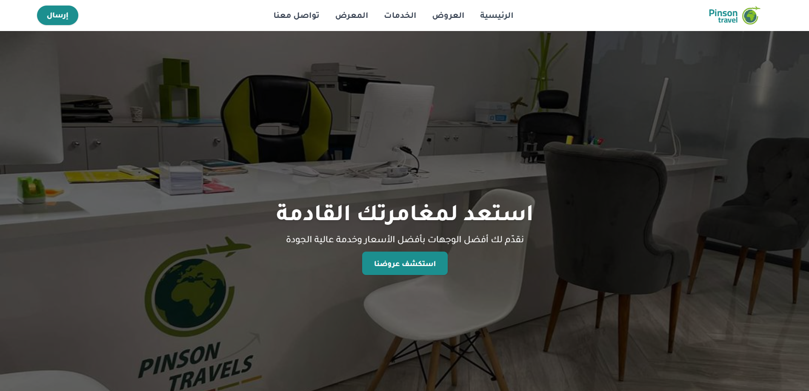
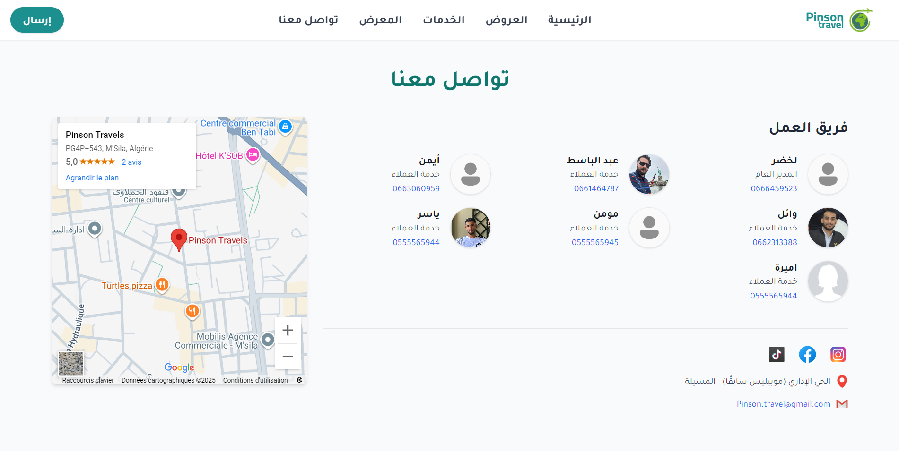
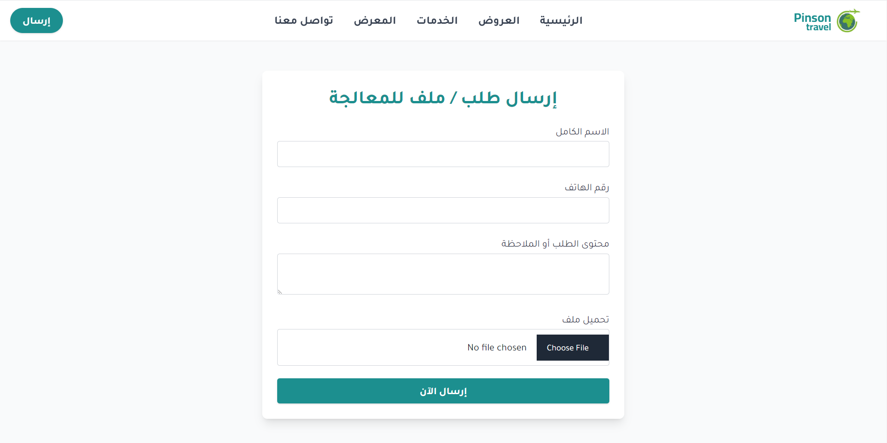

# 🌍 Pinson Travel App
A modern web application to manage travel offers, galleries, services, and client interactions.  
Built with Flask, HTML templates, and static assets (images, CSS, JS).

---

## ✨ Features
- 📌 Dynamic homepage with travel offers and services.  
- 🖼️ Gallery showcase for destinations.  
- 🌍 Multi-country flag support.  
- 📨 Contact & feedback forms.  
- 🎨 Organized static assets (CSS, JS, images, icons).  
- 🧩 Modular Flask app structure.

---

## 🛠️ Tech Stack
- **Backend:** Flask (Python)  
- **Frontend:** Jinja2 templates, HTML, CSS, JavaScript  
- **Assets:** Images, Icons, Flags  
- **Deployment:** Cross-platform (Windows/Linux)  

---

## 📂 Project Structure
```text
.
├── app.py               # Main Flask app
├── run_theapp.py        # Alternative app runner
├── forms.py             # Form handlers
├── pinson_travel.bat    # Windows run script
├── static/              # Static assets
│   ├── css/
│   ├── flag/
│   ├── gallery/
│   ├── icons/
│   ├── images/
│   ├── jss/
│   ├── offers/
│   └── team/
├── templates/           # HTML templates
│   ├── contact.html
│   ├── feedback.html
│   ├── gallery.html
│   ├── home.html
│   ├── layout.html
│   ├── offer_details.html
│   ├── offers.html
│   └── services.html
├── uploads/             # Uploaded files
├── __pycache__/         # Python cache files (ignored by Git)
└── README.md
```

### 📸 Screenshots

(Add screenshots for homepage, gallery, and offers section here)

### Homepage


### Offers


### Contacts


### Send Mail



### 📜 License  
This project is licensed under the MIT License – see the [LICENSE](LICENSE) file for details.  

### 🔒 Privacy  
See the [PRIVACY.md](PRIVACY.md) file for details about how we handle user data.

